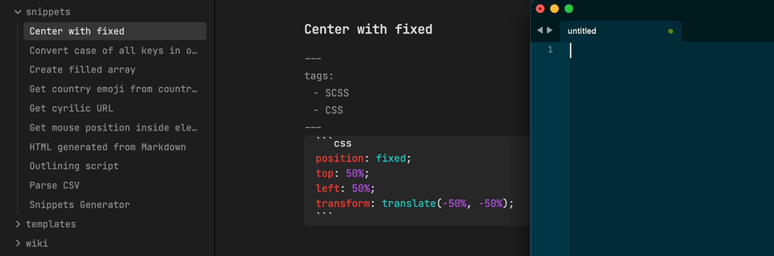

# Markdown Snippets Alfred Workflow

Search and paste your snippets stored as [markdown files](https://raw.githubusercontent.com/brachkow/alfred-markdown-snippets/main/snippet-example.md).

## How to use

1. Put you [markdown files with snippets](https://raw.githubusercontent.com/brachkow/alfred-markdown-snippets/main/snippet-example.md) into one folder. Snippets should be stored flat (no nested folders).
2. [Download and install workflow](https://github.com/brachkow/alfred-markdown-snippets/releases). In installation window put your folder path as ROOT variable.
3. In Alfred Preferences go to Features > Snippets and disable or change «Snippet keyword»
4. Enter snip to search through your snippets

## Credits

- [@sindresorhus](https://github.com/sindresorhus) for [alfy](https://github.com/sindresorhus/alfy) which makes nodejs workflows possible
- [@krisk](https://github.com/krisk) for [fuse](https://github.com/krisk/Fuse) that powers fuzzy search
- Apple for «Paste» icon from SF Symbols
